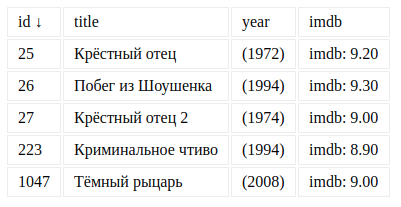

[](https://ci.appveyor.com/project/VarsPtz/ahj-homework-in-memory-sorting)

[GitHub Pages](https://varsptz.github.io/ahj-homework-in-memory-sorting/)


Правила сдачи задания:

1. **Важно**: в рамках этого ДЗ можно использовать любой менеджер пакетов
1. **Важно**: всё должно собираться через Webpack (включая картинки и стили) и выкладываться на Github Pages через Appveyor.
1. В README.md должен быть размещён бейджик сборки и ссылка на Github Pages
1. В качестве результата присылайте проверяющему ссылки на ваши GitHub-проекты

---


Важно: не используйте `removeChild`! Проверьте, что будет, если `Node` изменить родителя.

Всё должно собираться через Webpack (включая картинки и стили) и выкладываться на Github Pages через CI.

**В качестве результата пришлите проверяющему ссылку на ваш GitHub-проект. Не забудьте установить бейджик сборки.**

---
### In-Memory Sorting

#### Легенда

Достаточно намучившись с `data-*` вы поняли, что хранить всю информацию в DOM и в атрибутах в частности, не всегда самая лучшая идея и решили реализовать хранение в памяти.

#### Описание

Формат приходящих данных (JSON):
```json
[
  {
    "id": 26,
    "title": "Побег из Шоушенка",
    "imdb": 9.30,
    "year": 1994
  },
  {
    "id": 25,
    "title": "Крёстный отец",
    "imdb": 9.20,
    "year": 1972
  },
  {
    "id": 27,
    "title": "Крёстный отец 2",
    "imdb": 9.00,
    "year": 1974
  },
  {
    "id": 1047,
    "title": "Тёмный рыцарь",
    "imdb": 9.00,
    "year": 2008
  },
  {
    "id": 223,
    "title": "Криминальное чтиво",
    "imdb": 8.90,
    "year": 1994
  }
]


Храните все полученные объекты в памяти в виде массива и сортировку осуществляйте на базе этого массива (мутировать массив или нет - решать вам). После каждой сортировки пересобирайте заново дерево DOM.

Формат генерируемого DOM должен быть такой же, как в предыдущей задаче.

Внешний вид без сортировки (вы можете визуально улучшить отображение):


Обратите внимание, в каком виде выводятся оценки (после точки всегда два символа).

При сортировке по id (по возрастанию):



Обратите внимание на стрелку возле id.